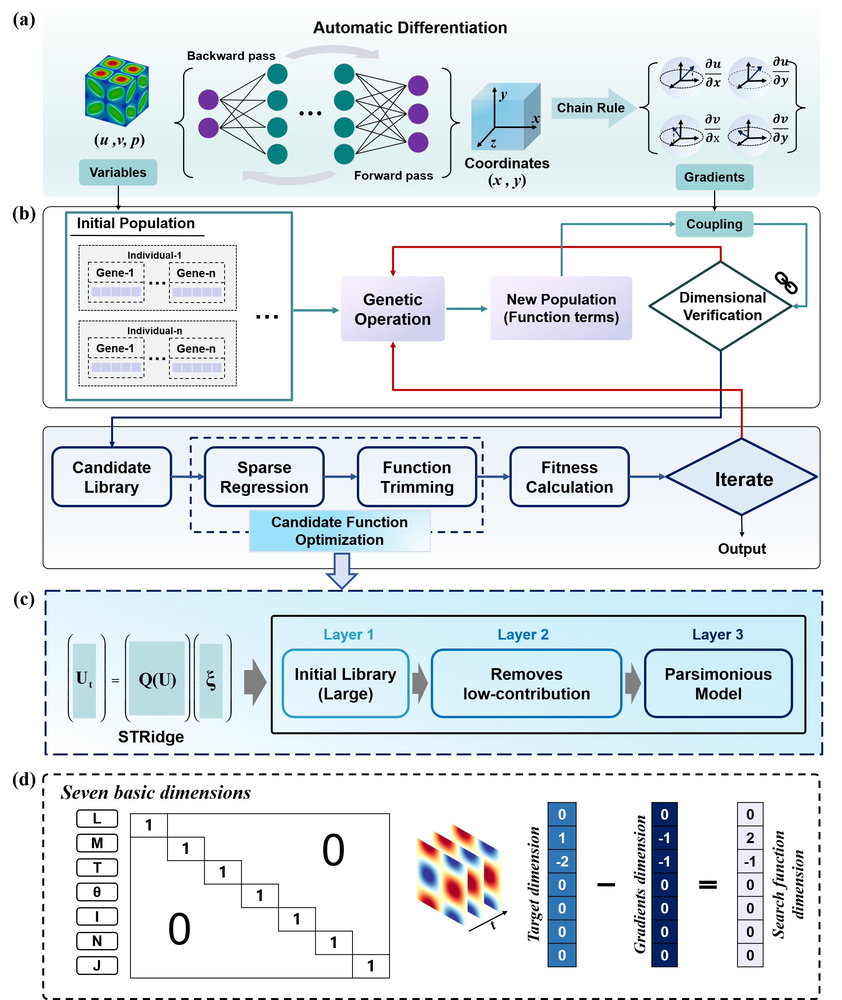

# PARSE: Physics-Aware Regression with Symbolic Expansion
This open-source repository contains the Python implementation codes for the aforementioned research paper.
## Abstract
Many engineering systems exhibit partially known governing structures, where differential operators are known a priori but closures and state-dependent coefficients remain undetermined. Pure sparse regression is limited by incomplete candidate libraries, while evolutionary approaches suffer from exponentially large search spaces, overfitting, and uncontrolled complexity. To address these challenges, we propose the Physics-Aware Regression with Symbolic Expansion (PARSE) framework, which combines prior knowledge of differential operators with gene expression programming (GEP) to construct an extended candidate library of structure-preserving basis terms and nonlinear functional terms. Dimensional-consistency constraints and a function trimming strategy are incorporated to eliminate inadmissible and redundant candidates, yielding parsimonious, physically interpretable models. PARSE is validated on three benchmarks: the Korteweg–de Vries (KdV) equation, the point-source diffusion equation, and the Taylor–Green vortex. Across varying noise levels, multi-parameter coupling conditions, and dimensional/dimensionless settings, PARSE reliably recovers both equation structure and leading-order coefficients. Under 9\% uniform noise, PARSE recovers the correct KdV equation structure where conventional sparse regression (without trimming) fails and reduces wall-clock time by approximately one order of magnitude relative to the dimensional-homogeneity-constrained GEP in the diffusion-equation benchmark. By unifying function-space expansion, physics-informed filtering, and sparse model reduction, PARSE provides a robust and interpretable framework for equation discovery in systems with partially known structure.
## Framework of PARSE

PARSE combines gene expression programming (GEP) with sparse regression; its overall architecture is shown in __Fig.__. Within this pipeline, GEP automatically generates candidate nonlinear functional expressions by searching for unknown functional forms. Automatic differentiation (AD) calculates gradients of flow field variables.  We assemble an expanded candidate library by combining GEP-derived functional terms with AD-computed gradient information. As an initial filtering step, a dimensional consistency constraint is enforced to discard candidate expressions inconsistent with physical dimensional laws. Sparse regression is  performed on the refined library to select dominant terms and fit corresponding coefficients. We further apply a function pruning scheme to measure per-term importance and remove redundant candidates, improving model sparsity and generalization. This selection workflow reduces overfitting from large candidate pools and permits joint recovery of governing equation structures and unknown coefficients.

