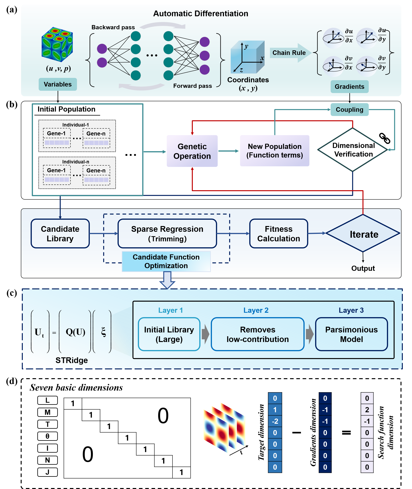

# PARSE: Physics-Aware Regression with Symbolic Expansion
This open-source repository hosts the official Python implementation for our research paper
## Abstract
Many fluid and transport systems have partially known governing structures, in which differential operators are prescribed by conservation laws, while closure terms or state-dependent coefficients remain unknown. Sparse regression may fail when essential terms are absent from the candidate library. Evolutionary symbolic regression relaxes this restriction, but often suffers from large search spaces, overfitting, and poorly controlled expression complexity. To address these challenges, we propose the Physics-Aware Regression with Symbolic Expansion (PARSE) framework, which combines gene expression programming (GEP) with sparse regression, leveraging prior knowledge of the differential operators, to construct an extended candidate library of structure--preserving basis terms and nonlinear functional terms. Dimensional--consistency constraint is incorporated to eliminate inadmissible and redundant candidates, yielding parsimonious, physically interpretable models. PARSE is validated on four benchmarks involving both known and previously unknown equations under different noise levels, parameter-coupled conditions, and dimensional and dimensionless settings. Across all tested benchmarks, PARSE identifies the dominant equation structures and leading--order coefficients. It recovers the correct equation structures while reducing the computation time by approximately one order of magnitude relative to conventional GEP. The corrected heat-conduction relation is more accurate than the Navier--Stokes--Fourier (NSF) equation over a wider range of Mach numbers. By combining function-space expansion, physics-based filtering, and sparse model reduction, PARSE provides a physically constrained and interpretable approach to equation discovery in systems with partially known governing structures.

## Framework of PARSE

PARSE integrates GEP with sparse regression, and its overall framework is illustrated in __Fig.The PARSE framework.__ In this framework, GEP is used to generate nonlinear candidate functions by exploring unknown functional forms. Automatic differentiation (AD) is used to compute spatial derivatives of the flow variables. A neural network is first trained to establish a continuous mapping from the spatiotemporal coordinates to the flow variables, providing a differentiable representation of the observed flow field. AD then evaluates the required derivatives by applying the chain rule throughout the fitted computational graph. Unlike finite-difference approximations, this procedure does not require discrete difference schemes. Derivatives of the flow variables with respect to the spatiotemporal coordinates are then evaluated by systematically applying the chain rule throughout the fitted computational graph, without constructing discrete difference schemes. The resulting derivative terms are coupled with the GEP-generated functional terms to construct an extended candidate library. Dimensional analysis is introduced as a preliminary screening criterion to eliminate expressions that violate physical consistency. Sparse regression is then applied to the resulting candidate library to identify a parsimonious representation of the governing equation. This process identifies the equation structure and estimates its coefficients, while removing redundant terms and reducing the risk of overfitting.


<div align="center">

</div>

## Dependencies

- Python  3.13.11
- geppy
- operator 
- torch  2.10.0+cu128 (CUDA Version: 12.8)
  
All computations are performed on a workstation equipped with dual AMD EPYC 7K83 CPUs and an NVIDIA GeForce RTX 4090D GPU. 

## Run cases
To run PARSE, users should split input variables into base terms and functional terms, and assign corresponding dimensional units to each input variable.
```
Function_names =  ['u','v','rho','p','miu']
Gradient_names =  ['u_x','u_y','v_x','v_y','p_x','p_y','u_xx','u_yy','v_xx','v_yy','cons']
```
